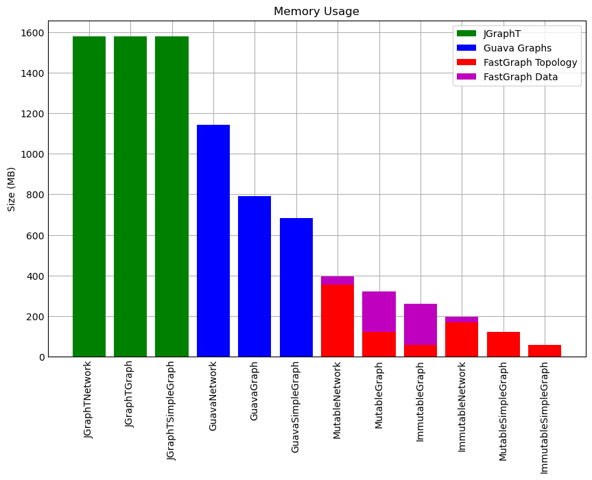

[](https://central.sonatype.com/artifact/io.github.sooniln/fastgraph)
[](https://javadoc.io/doc/io.github.sooniln/fastgraph)

# FastGraph

A highly efficient mathematical graph-theory library for JVM.

FastGraph is designed primarily read-heavy work. When there is a design choice between optimizing read paths vs write
paths in this library, generally read paths are optimized at the expense of write paths.

## Quick Start

Unlike most other graph libraries, FastGraph stores and models graph topologies and graph data separately. The basic
`Graph` class which is the building block of FastGraph thus represents a set of vertices and edges, but not any data
associated with vertices and edges. Data is stored separately in `VertexProperty` and `EdgeProperty` instances, which
are associated with a particular graph. While this may seem non-obvious at first, it comes with many usability and
performance benefits which will be discussed later.

You can add FastGraph as a dependency in your project with:

#### Gradle

```groovy
implementation 'io.github.sooniln:fastgraph:0.1.0'
```

#### Maven

```xml

<dependency>
    <groupId>io.github.sooniln</groupId>
    <artifactId>fastgraph</artifactId>
    <version>0.1.0</version>
</dependency>
```

### Hello FastGraph

Let's start with a simple example of how to construct a `Graph`:

```kotlin
// create an undirected mutable graph
val graph: MutableGraph = mutableGraph(directed = false)

// add three vertices and store references in local variables
val vertex1: Vertex = graph.addVertex()
val vertex2: Vertex = graph.addVertex()
val vertex3: Vertex = graph.addVertex()

// add three edges and store references in local variables
val edge1: Edge = graph.addEdge(vertex1, vertex2)
val edge2: Edge = graph.addEdge(vertex2, vertex3)
val edge3: Edge = graph.addEdge(vertex3, vertex1)
```

We've now created a graph with 3 vertices, and 3 edges connecting them. But what if we wanted to associate data with
vertices and edges?

```kotlin
val graph: MutableGraph = mutableGraph(directed = false)
val vertexName: VertexProperty<String> = graph.createVertexProperty() { "" }
val edgeWeight: EdgeProperty<Float> = graph.createEdgeProperty() { 0f }

val vertex1: Vertex = graph.addVertex()
vertexName[vertex1] = "vertex1"
val vertex2: Vertex = graph.addVertex()
vertexName[vertex2] = "vertex2"
val vertex3: Vertex = graph.addVertex()
vertexName[vertex3] = "vertex3"

val edge1: Edge = graph.addEdge(vertex1, vertex2)
edgeWeight[edge1] = 1.0f
val edge2: Edge = graph.addEdge(vertex2, vertex3)
edgeWeight[edge2] = 1.5f
val edge3: Edge = graph.addEdge(vertex3, vertex1)
edgeWeight[edge3] = 1.9f
```

Now we've created a `String` property for vertices (with a default value of `""`) and `float` property for edges (with a
default value of `0f`). This is all getting a bit verbose however - is there an easier way to initialize a graph and
vertex/edge properties? Yes, we can use the `buildGraph()` helper method to achieve the exact same thing:

```kotlin
val graph: MutableGraph = mutableGraph(directed = false)
val vertexName: VertexProperty<String> = graph.createVertexProperty() { "" }
val edgeWeight: EdgeProperty<Float> = graph.createEdgeProperty() { 0f }

buildGraph(graph, vertexName, edgeWeight) {
    addEdge("vertex1", "vertex2", 1.0f)
    addEdge("vertex2", "vertex3", 1.5f)
    addEdge("vertex3", "vertex1", 1.9f)
}
```

The `addEdge` method exposed by `buildGraph` can create new vertices with the given property value if they don't exist
already, and then link the vertices with a new edge (with the given edge property value).

Once we've constructed a graph, we can access and traverse the graph structure easily:

```kotlin
val graph: Graph = ...

// iterate over all vertices in the graph
for (vertex in graph.vertices) {
    // iterate over all outgoing edges from the current vertex
    for (edge in graph.outgoingEdges(vertex)) {
        ...
    }
}

// iterate over all edges in the graph
for (edge in graph.edges) {
    // retrieve the source and target vertices of the given edge
    val source: Vertex = graph.edgeSource(edge)
    val target: Vertex = graph.edgeTarget(edge)
}

// iterate over all vertices that can be reached via outgoing edge from myVertex
val myVertex = vertex.successors.first()
for (vertex in graph.successors(vertex)) {
    ...
}
```

This is a very brief introduction to some of the capabilities of FastGraph - for a more detailed look at FastGraph APIs
and capabilities see the [Getting Started](docs/GETTING_STARTED.md) docs.

## Competitors

The main competitor graph-theory libraries for Java/Kotlin are [JGraphT](https://jgrapht.org/) and
[Guava Graphs](https://github.com/google/guava/wiki/GraphsExplained). There also exists
[JUNG](https://github.com/jrtom/jung), but this is an older and unmaintained library which has partly been superseded
by Guava Graphs.

Some (biased) observations on these libraries:

* JGraphT and Guava Graphs store topology and data together - there is no division. This can make for a more 'natural'
  interface in some ways, especially for beginner graph users, but breaks down in more complex scenarios, and prevents
  many opportunities for optimizations (one of the reasons that FastGraph can substantially outperform both of these
  libraries). This also enforces stringent uniqueness and `hashcode()`/`equals()` requirements on clients implementing
  vertex and edge types which are not always easy to understand or comply with (see for example the extensive
  [JGraphT requirements](https://jgrapht.org/guide/VertexAndEdgeTypes)).
* JGraphT has a somewhat more difficult to understand and use API - it is reminiscent of an older style of API that does
  not entirely fit well with modern Java/Kotlin concepts. The API is still perfectly usable, but often does not compose
  well and occasionally fights with the user.
* JGraphT generally out-performs Guava Graphs, but uses a much (much) larger amount of memory to represent graphs.
* JGraphT provides an exceptionally complete and well-rounded library of various graph algorithms.
* Guava Graphs has a modern, simple API (the FastGraph API is modeled on Guava Graphs APIs in many ways, and uses many
  of the same concepts), but generally provides the worst performance of all the libraries.
* Guava Graphs (and FastGraph as well at the moment) focus on providing clean core APIs, and do not provide an extensive
  library of graph algorithms, believing this is a task better suited for the client.

## Benchmarks

Benchmarking was performed with [JMH](https://github.com/openjdk/jmh), and benchmarking code is checked in to this
repository. Memory measurements were made with [JOL](https://github.com/openjdk/jol). All benchmarks were performed on
the same machine and on the same data sets. Benchmark results are intended to be comparative, not absolute.

For further benchmarks and details on how to interpret the data see
the [Detailed Benchmarks](docs/DETAILED_BENCHMARKS.md)
docs.




## Dependencies

* JDK 17+
* [fastutil-core](https://github.com/vigna/fastutil/) is used to support memory and CPU efficient primitive collections.

## Attributions

FastGraph uses SNAP datasets from the [Stanford Large Network Dataset Collection](http://snap.stanford.edu/data) for
testing and benchmarking.
